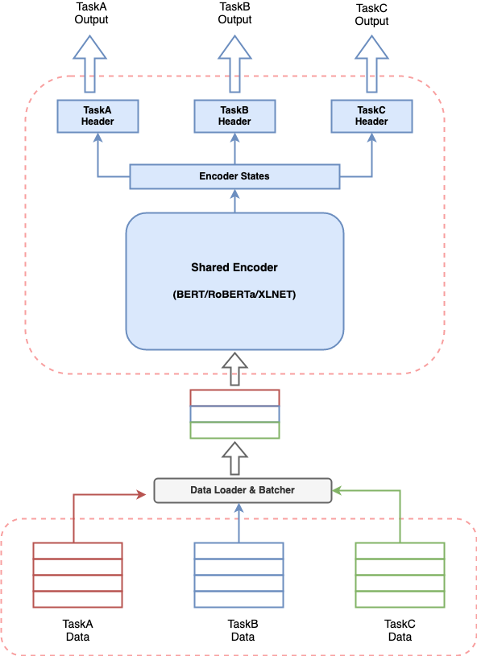

==============
multi-task-NLP
==============

multi_task_NLP is a utility toolkit enabling NLP developers to easily train and infer a single model for multiple tasks.
We support various data formats for majority of NLI tasks and multiple transformer-based encoders (eg. BERT, Distil-BERT, ALBERT, RoBERTa, XLNET etc.)

What is multi_task_NLP about?
-----------------------------

Any conversational AI system involves building multiple components to perform various tasks and a pipeline to stitch all components together.
Provided the recent effectiveness of transformer-based models in NLP, it’s very common to build a transformer-based model to solve your use case.
But having multiple such models running together for a conversational AI system can lead to expensive resource consumption, increased latencies for predictions and make the system difficult to manage.
This poses a real challenge for anyone who wants to build a conversational AI system in a simplistic way.

multi_task_NLP gives you the capability to define multiple tasks together and train a single model which simultaneously learns on all defined tasks.
This means one can perform multiple tasks with latency and resource consumption equivalent to a single task.

Installation
------------

To use multi-task-NLP, you can clone the repository into the desired location on your system
with the following terminal command.

.. code-block:: console

   $ cd /desired/location/
   $ git clone https://github.com/hellohaptik/multi-task-NLP.git
   $ cd multi-task-NLP
   $ pip install -r requirements.txt 

NOTE:- The library is built and tested using ``Python 3.7.3``. It is recommended to install the requirements in a virtual environment.

Quickstart Guide
----------------
A quick guide to show how a single model can be trained for multiple NLI tasks in just 3 simple steps
and with **no requirement to code!!**

.. toctree::
   quickstart

Examples Guide
--------------
We provide exemplar notebooks to demonstrate some conversational AI tasks which can be perfomed using our library.
You can follow along the `notebooks <https://github.com/hellohaptik/multi-task-NLP/tree/master/examples/>`_ to understand and train a multi-task model for the tasks.

.. toctree::
   :maxdepth: 2

   examples

Step by Step Guide
------------------
A complete guide explaining all the components of multi-task-NLP in sequential order.

.. toctree::
   :maxdepth: 2

   task_formats
   data_transformations
   shared_encoder
   define_multi_task_model
   training
   infering
   license

